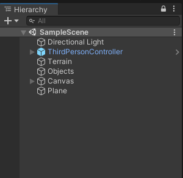
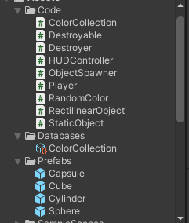
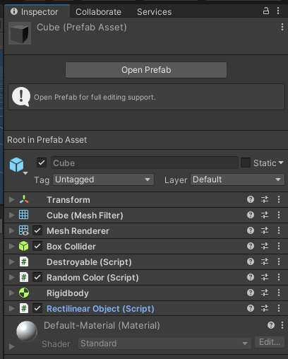
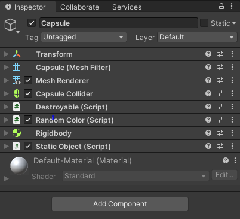
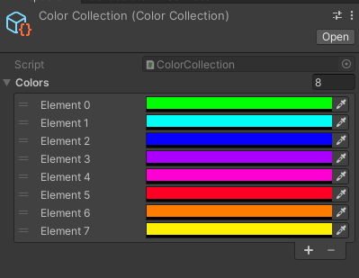
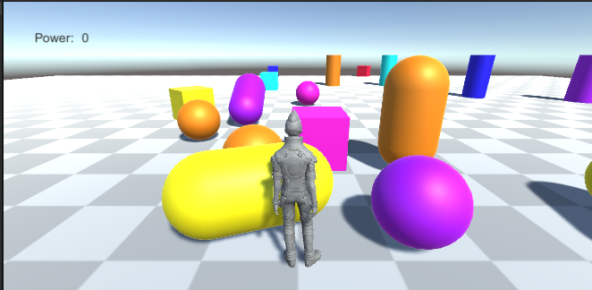
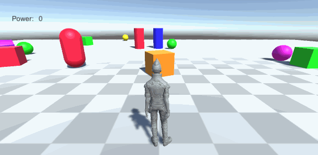
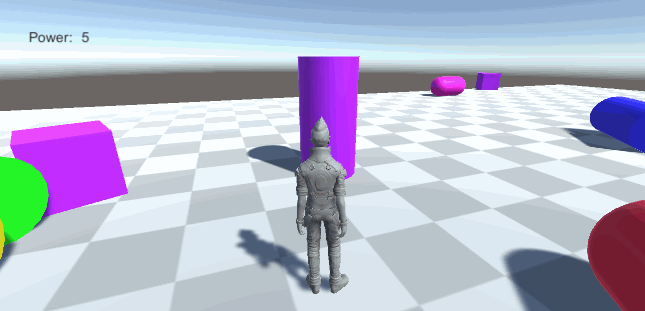
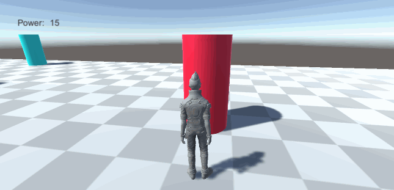

# Práctica 2 - Programación de Scripts

* Todos los objetos pueden ser formas básicas (cubos, esferas, cilindros).
* Los objetos se distribuyen por la escena y se catalogan en dos tipos, en movimiento rectilíneo y estáticos.
* Algunos objetos son estáticos, el jugador cuando colisiona, los desplaza una cantidad proporcional a su poder.
* Otros objetos al colisionar se desplazan por la fuerza que ejerce el jugador sobre ellos y hacen que el jugador sume puntos.
* Cuando el jugador suma puntos, las dimensiones del objeto disminuyen y se atenúa su color, cuando se llega a un umbral desaparece el objeto.

## Imágenes en Editor

### Proyecto

### Prefabs
El cubo sería ejemplo un objeto con movimiento rectilíneo y la cápsula sería un ejemplo de objeto estático.

Este ScriptableObject se usa para definir el conjunto de colores que usará el Script [ObjectSpawner.cs](Assets/Code/ObjectSpawner.cs)

## Imágenes en funcionamiento

### Empezando a jugar

### Poder

* Cuando colisionamos contra un objeto de movimiento rectilíneo, el jugador gana poder, el objeto se hace más pequeño y se atunúa el color.

* Cuando colisionamos contra un objeto estático, lo movemos de forma proporcional a nuestro poder.

