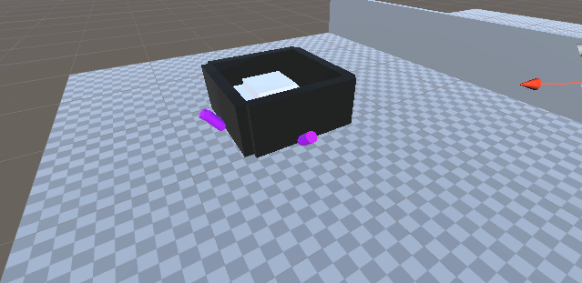

# Eventos y Movimiento rectilíneo.

* Implementar una UI que permita configurar con qué poder jugarás: turbo y restas una vida o normal.
* Agregar a tu escena un objeto que al ser recolectado por el jugador desplace del juego un tipo de objetos que puedan representar obstáculos, a modo de barreras que abren caminos.
* Agrega un objeto que te teletransporte a otra zona de la escena.
* Agrega un objeto físico que muevas con las teclas wasd.
* Agrega un personaje que se dirija hacia un objetivo estático en la escena.
* Agrega un personajes que se dirija al objeto del apartado 4.

## Movimiento wasd

El cubo (jugador) se mueve con las teclas WASD, que junto a la cámara dan posibilidad de explorar el mapa. 
Cuando se mueve la cámara, cambia la dirección a la que se mueve el jugador, de tal manera que podemos movernos de manera intuitiva.

## Cámara

Según la rotación del ratón, se mueve la cámara para poder tener visión del mapa.

## Botón turbo
Existe este botón en la UI, que cualquier otro objeto puede registrarse al evento y hacer algo

## Teletransportación
Cuando cualquier objeto pise la zona roja, se teletransportará a otra zona designada. [Teleport.cs](Assets/Scripts/Teleport.cs)

## Barreras
Cuando se coge un objeto de la clase [Pickable](Assets/Scripts/Pickable.cs), el [GateManager](Assets/Scripts/GateManager.cs) abre una puerta: ([Gate](Assets/Scripts/Gate.cs))

## Movimiento autónomo
Hay enemigos que se mueven a un punto fijo en el mapa y otro que se mueve a la posición del jugador

Esto se consigue con el mismo comportamiento, que el objeto que tiene el script [EnemyController](Assets/Scripts/EnemyController.cs), perseguirá a su *target*, se mueva éste o no.

